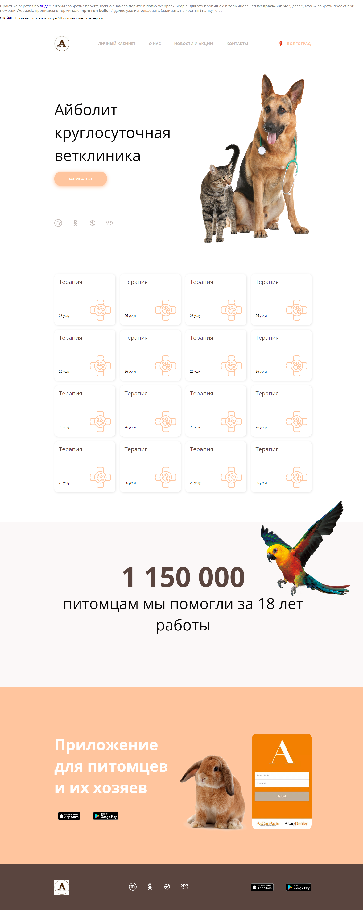

# App React: Animal

## GH-Pages: https://weboson.github.io/animal

### Description: 
- en: Website layout using webpack;
- ru: Верстка сайта с использованием webpack.

***
## Screenshots

### 1. HomePage:

# Stack--
1. React: "^18.2.0",
2. webpack: "^5.66.0", 
4. "css-loader": "^6.5.1",
5. "html-loader": "^3.1.0",
6. "mini-css-extract-plugin": "^2.5.2",
7. "sass": "^1.49.0",
8. "sass-loader": "^12.4.0",
9. "style-loader": "^3.3.1",

### Running the app (watch mode)
- npm run dev

### Stay in touch
- Author - [Rishat Weboson](...)
- Website - [https://weboson.ru](...)

### License
Nest is [MIT licensed](LICENSE).